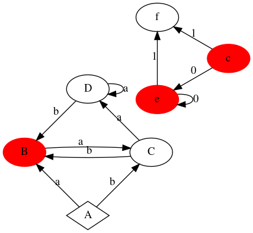
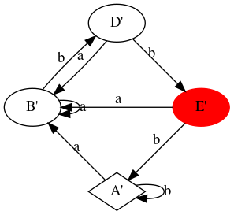

#  ДКА => Минимальный ДКА
## Требования

Библиотеки: 
- graphviz 
- matplotlib
- pillow 

## Запуск 
```math
python MinimizationDFA.py path_to_xml/test.xml
```

## Примеры работы

Все xml файлы на которых я тестировал программу лежат в папку tests.

- Начальное состояние автомата обозначено ромбом.
- Выходное состояние автомата выделено красным цветом.

- ### tests/test2.xml


Минимальный автомат, соответствующий ему.


- ### tests/test3.xml
ДКА


Минимальный автомат, соответствующий ему.


- ### tests/test4.xml
ДКА


Минимальный автомат, соответствующий ему.


- ### tests/test5.xml
ДКА


Минимальный автомат, соответствующий ему.


- ### tests/test6.xml
ДКА


Минимальный автомат, соответствующий ему.


- ### tests/test7.xml
ДКА



Минимальный автомат, соответствующий ему.


- ### tests/test8.xml
ДКА


Минимальный автомат, соответствующий ему.


- ### tests/test9.xml
ДКА


Минимальный автомат, соответствующий ему.




- ### tests/test10.xml
ДКА


Минимальный автомат, соответствующий ему.


